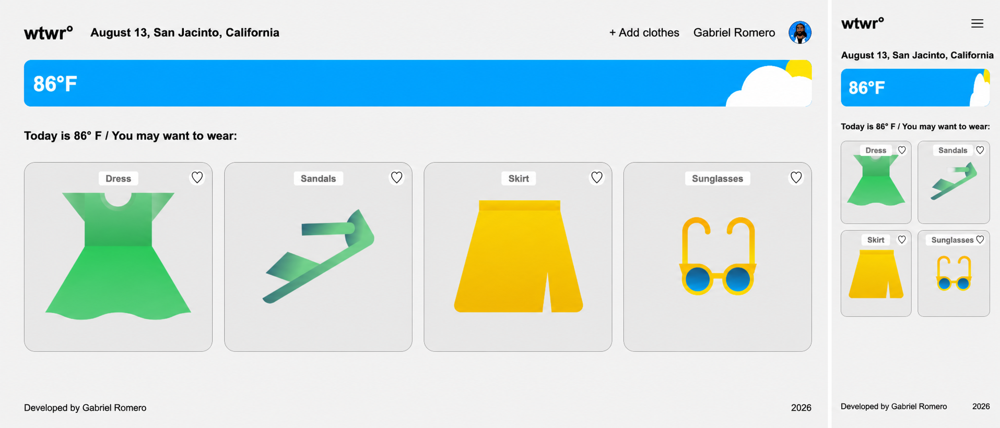

# WTWR

WTWR is a responsive weather-based clothing recommendation app. It displays the current temperature, filters clothing suggestions by weather condition, and opens simple add-clothing and item-detail modals.



## Technologies

- React
- Vite
- JavaScript
- CSS media queries
- OpenWeather API
- Prettier for consistent code formatting

## Running locally

Install the dependencies and start the development server:

```bash
npm install
npm run dev
```

To use live weather data, add an OpenWeather API key to `.env`. The app uses San Jacinto, California as its default location and shows fallback weather data when the key is missing or the request fails.

Run `npm run format` to format the project with Prettier.
